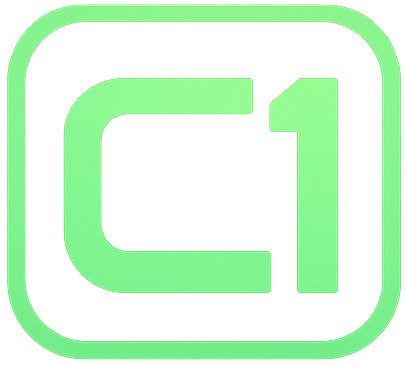

 

  

# Cedar One · 

Cedar One is a CSS-first, framework-agnostic foundation for the
[Cedar design system](https://cedar.rei.com).

Components ship as native HTML and static CSS, with design intent defined by tokens
and shared across platforms.

Instead of embedding behavior and validation into framework components, Cedar One
pushes those concerns into build-time tooling and small, explicit adapters. This keeps
runtime output lean, predictable, and portable.

Explore the system:

- [HTML](https://rei.github.io/rei-cedar-one/html)
- [Vue](https://rei.github.io/rei-cedar-one/vue)
- [React](https://rei.github.io/rei-cedar-one/react)

## Packages

| Name             | Description                                  |
| ---------------- | -------------------------------------------- |
| `@rei/c1-tokens` | Design tokens and platform outputs           |
| `@rei/c1-ui`     | CSS, component styles, and behavior adapters |
| `@rei/c1-icons`  | Icon assets and framework wrappers           |
| `@rei/c1-lint`   | ESLint rules for component contracts         |
| `@rei/c1-html`   | HTML Storybook for CSS-first components      |
| `@rei/c1-vue`    | Vue component library and Storybook          |
| `@rei/c1-react`  | React component library and Storybook        |
