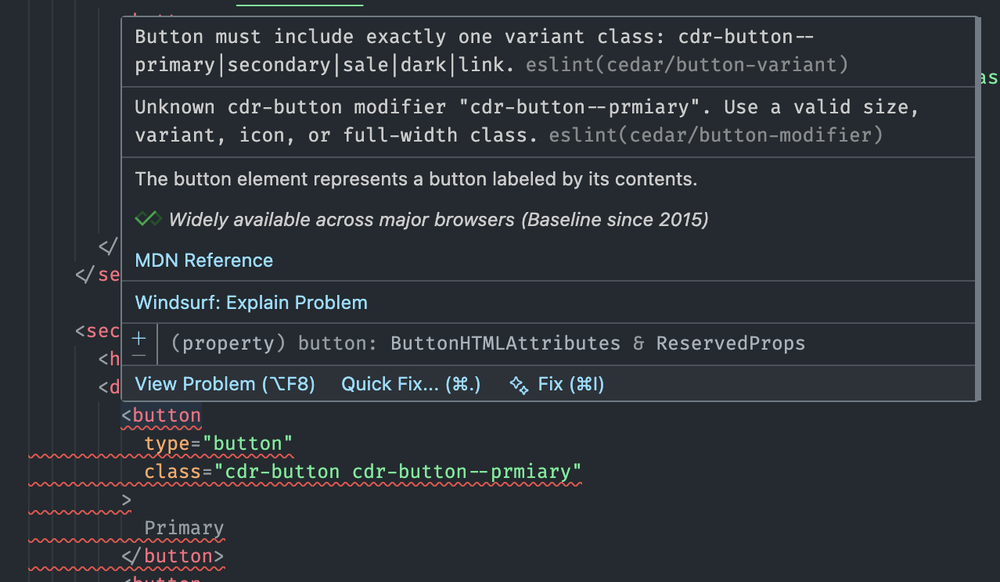

# Cedar One Architecture

This document outlines the architectural principles and near-term goals that guide Cedar One.

## Architectural principles

- **Tokens as the source of truth:** design values drive all platform outputs.
- **CSS-first web delivery:** utilities and recipes cover most styling without framework bindings.
- **Adapters at the edges:** behavioral and platform-specific logic is introduced only where required.
- **Build-time validation:** ESLint and tooling enforce contracts so validation is not shipped at runtime.
- **Monorepo orchestration:** `pnpm` workspaces manage packages, tooling, and sandboxes.

## Goals

- Reduce bundle size by favoring static CSS over runtime abstractions.
- Simplify authoring through composable utilities and recipes.
- Remain framework-agnostic for the web.
- Enable native application development through shared tokens and platform adapters.
- Provide both prebuilt CSS and an optional UnoCSS preset for on-demand utility generation.
- Improve developer experience through tooling and editor integrations.

## Build-time contract enforcement

Cedar One enforces component contracts through development tooling, such as ESLint, rather than shipping validation logic in framework code.

_Example: ESLint enforcing `cdr-button` contract rules at development time._

## VS Code extension ideas

The Cedar One architecture enables strong editor support by making contracts and constraints explicit at build time.

### Editor assistance

- **Autocomplete:** suggest valid `cdr-` utility and component classes based on known variants, sizes, and tags for HTML, Vue, and JSX.
- **Inline diagnostics:** surface Cedar ESLint rule violations while typing, with clear, actionable messages.
- **Quick fixes:** fix typos, add required attributes, and remove invalid class combinations.
- **Snippets:** provide common patterns for buttons, icons, and responsive layouts that align with current rules.

### Discovery

- **Hover documentation:** show token values, descriptions, and usage tips sourced directly from tokens.
- **Token explorer:** searchable panel grouped by category with copy-to-clipboard support.
- **Storybook links:** jump from class names to the closest Storybook example.

## Non-goals

- Cedar One does not aim to provide a cross-platform runtime abstraction.
- It does not replace application frameworks or state management.
- It does not guarantee identical implementations across platforms; only consistent design intent.
